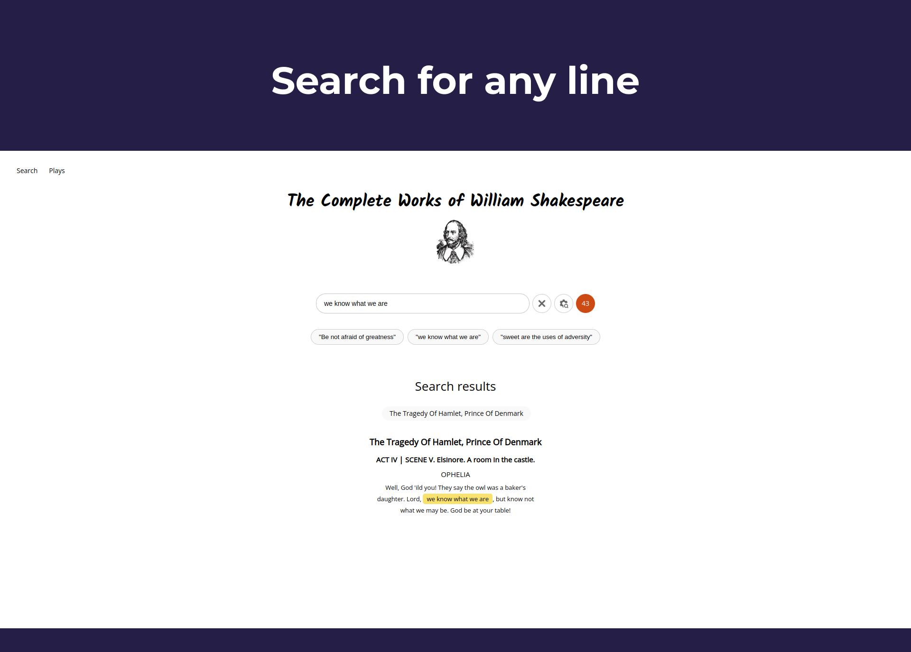
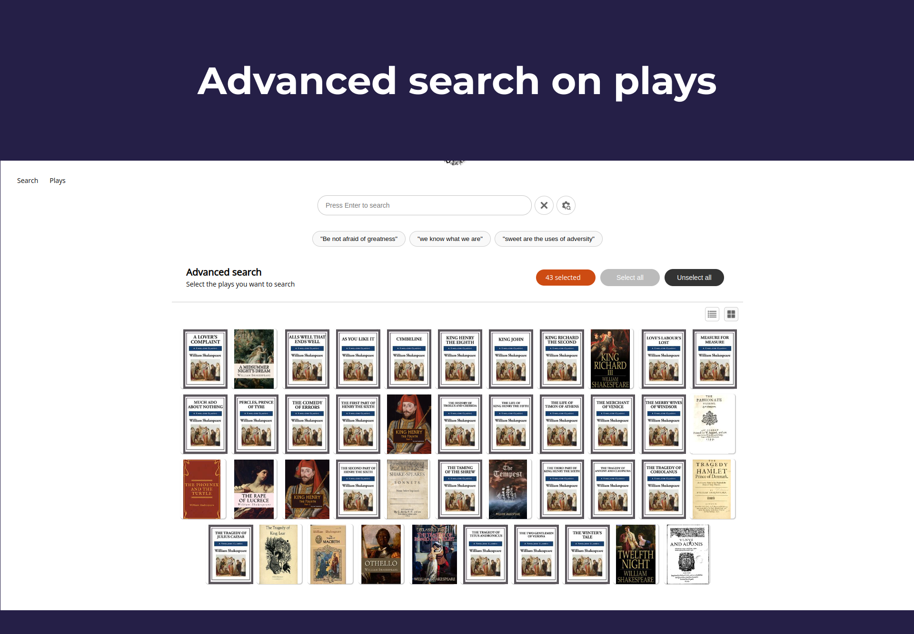
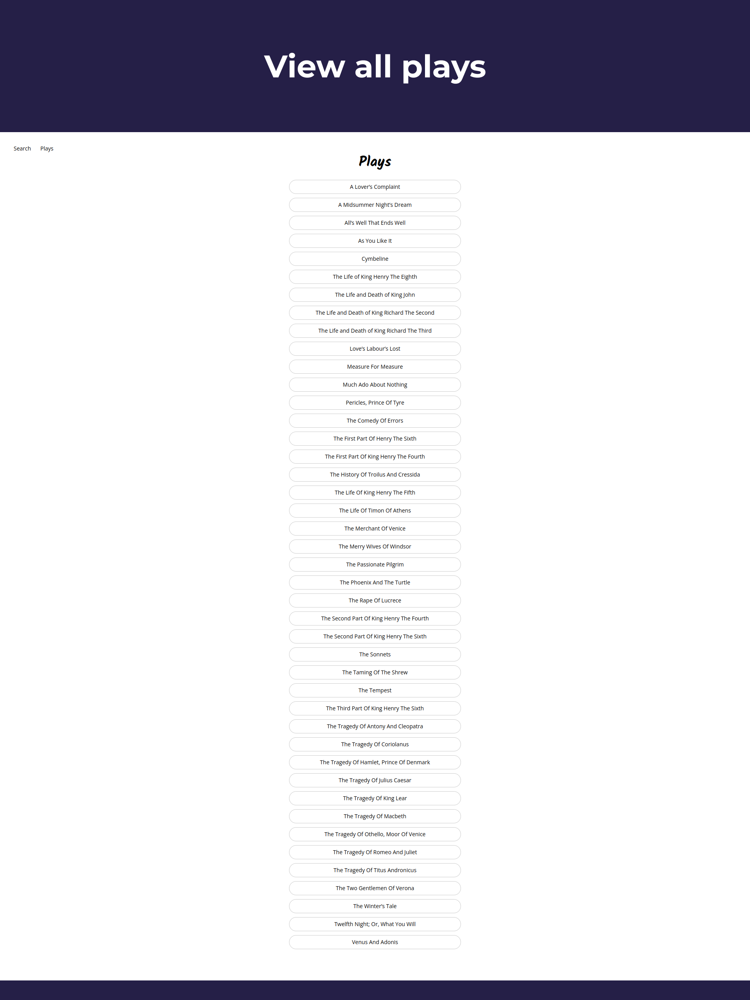
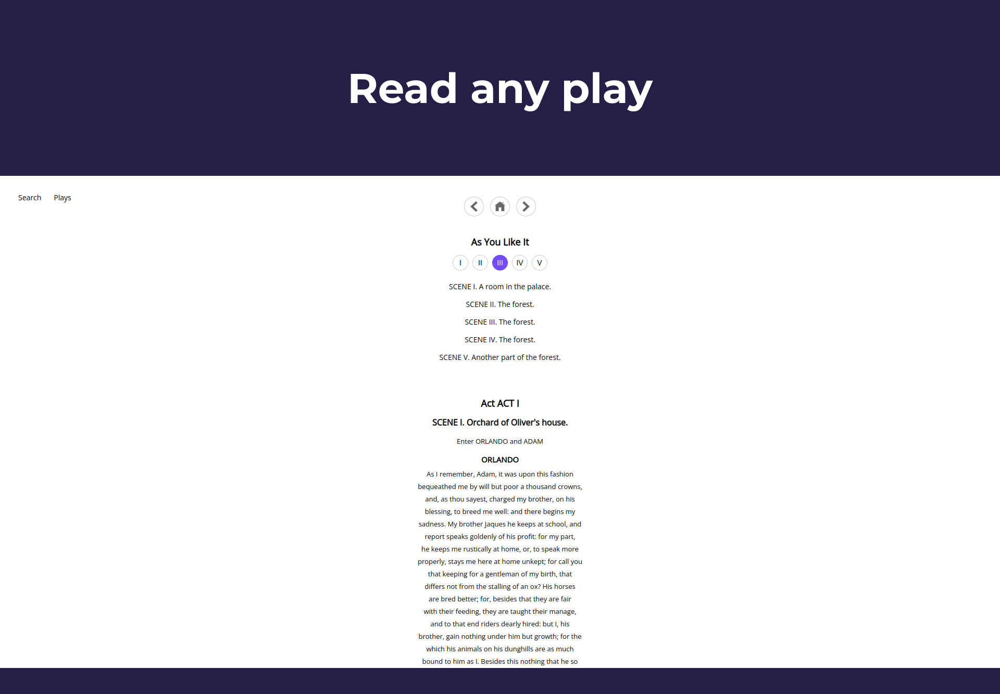

# Shakespeare Search



___

## About

A web app search engine for all of Shakespeare's plays, poems and sonnets. Find specific quotes and verses, highlighted with its precise location matched to your search input.

[Try shakesearch.com](https://shakespeare-search.netlify.app)


### Features 

1. **Suggested searches** to guide new users on how to use the search engine
2. `JSON formatting` of each play, allowing for precise location matching of any keyword search
3. **Advanced search**, where you can specifically select the plays that you want and don't want to search
4. **Highlight all matching results**, so you know exactly where that keyword appeared 
5. **Full list of plays**, in case you don't want to search and just want to read some Shakespeare



### Plays



| | Title |  
| - | - |
| 1 | [A Lover's Complaint](https://shakespeare-search.netlify.app/play/1000) |
| 2 | [A Midsummer Night’s Dream ](https://shakespeare-search.netlify.app/play/1001) | 
| 3 | [All’s Well That Ends Well ](https://shakespeare-search.netlify.app/play/1002) | 
| 4 | [As You Like It ](https://shakespeare-search.netlify.app/play/1003) | 
| 5 | [Cymbeline ](https://shakespeare-search.netlify.app/play/1004) | 
| 6 | [The Life of King Henry The Eighth ](https://shakespeare-search.netlify.app/play/1005) | 
| 7 | [The Life and Death of King John ](https://shakespeare-search.netlify.app/play/1006) | 
| 8 | [The Life and Death of King Richard The Second ](https://shakespeare-search.netlify.app/play/1007) | 
| 9 | [The Life and Death of King Richard The Third ](https://shakespeare-search.netlify.app/play/1008) | 
| 10 | [Love’s Labour’s Lost ](https://shakespeare-search.netlify.app/play/1009) | 
| 11 | [Measure For Measure ](https://shakespeare-search.netlify.app/play/10010) | 
| 12 | [Much Ado About Nothing ](https://shakespeare-search.netlify.app/play/10011) | 
| 13 | [Pericles, Prince Of Tyre ](https://shakespeare-search.netlify.app/play/10012) | 
| 14 | [The Comedy Of Errors ](https://shakespeare-search.netlify.app/play/10013) | 
| 15 | [The First Part Of Henry The Sixth ](https://shakespeare-search.netlify.app/play/10014) | 
| 16 | [The First Part Of King Henry The Fourth ](https://shakespeare-search.netlify.app/play/10015) | 
| 17 | [The History Of Troilus And Cressida ](https://shakespeare-search.netlify.app/play/10016) | 
| 18 | [The Life Of King Henry The Fifth ](https://shakespeare-search.netlify.app/play/10017) | 
| 19 | [The Life Of Timon Of Athens ](https://shakespeare-search.netlify.app/play/10018) | 
| 20 | [The Merchant Of Venice ](https://shakespeare-search.netlify.app/play/10019) | 
| 21 | [The Merry Wives Of Windsor ](https://shakespeare-search.netlify.app/play/10020) | 
| 22 | [The Passionate Pilgrim ](https://shakespeare-search.netlify.app/play/10021) |
| 23 | [The Phoenix And The Turtle ](https://shakespeare-search.netlify.app/play/10022) |
| 24 | [The Rape Of Lucrece ](https://shakespeare-search.netlify.app/play/10023) |
| 25 | [The Second Part Of King Henry The Fourth ](https://shakespeare-search.netlify.app/play/10024) | 
| 26 | [The Second Part Of King Henry The Sixth ](https://shakespeare-search.netlify.app/play/10025) | 
| 27 | [The Sonnets ](https://shakespeare-search.netlify.app/play/10026) |
| 28 | [The Taming Of The Shrew ](https://shakespeare-search.netlify.app/play/10027) | 
| 29 | [The Tempest ](https://shakespeare-search.netlify.app/play/10028) | 
| 30 | [The Third Part Of King Henry The Sixth ](https://shakespeare-search.netlify.app/play/10029) | 
| 31 | [The Tragedy Of Antony And Cleopatra ](https://shakespeare-search.netlify.app/play/10030) | 
| 32 | [The Tragedy Of Coriolanus ](https://shakespeare-search.netlify.app/play/10031) | 
| 33 | [The Tragedy Of Hamlet, Prince Of Denmark ](https://shakespeare-search.netlify.app/play/10032) | 
| 34 | [The Tragedy Of Julius Caesar ](https://shakespeare-search.netlify.app/play/10033) | 
| 35 | [The Tragedy Of King Lear ](https://shakespeare-search.netlify.app/play/10034) | 
| 36 | [The Tragedy Of Macbeth ](https://shakespeare-search.netlify.app/play/10035) | 
| 37 | [The Tragedy Of Othello, Moor Of Venice ](https://shakespeare-search.netlify.app/play/10036) | 
| 38 | [The Tragedy Of Romeo And Juliet ](https://shakespeare-search.netlify.app/play/10037) | 
| 39 | [The Tragedy Of Titus Andronicus ](https://shakespeare-search.netlify.app/play/10038) | 
| 41 | [The Two Gentlemen Of Verona ](https://shakespeare-search.netlify.app/play/10039) | 
| 42 | [The Winter’s Tale ](https://shakespeare-search.netlify.app/play/10041) | 
| 43 | [Twelfth Night; Or, What You Will ](https://shakespeare-search.netlify.app/play/10042) | 
| 44 | [Venus And Adonis ](https://shakespeare-search.netlify.app/play/10043) |



___

## Demo

1. Try `Live demo`
2. Try `Local demo`

### 1 | Live

[Try shakesearch.com](https://shakespeare-search.netlify.app)

### 2 | Local

Shakesearch is a React app with no additional dependencies. To try it locally, clone the repository, install the dependencies, and then just run it like any other React app.

```
git clone https://github.com/eduardocgarza/shakespeare-search
cd shakespeare-search
yarn install
yarn start
```

___
